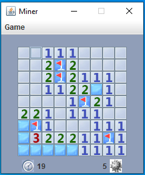

# MineSweeper

<hr/>

## Описание

Аналог игры "Сапер" из состава стандартных программ для Windows OS.

<p align="center">
    
</p>

Пример процесса игры

## Стэк используемых технологий:

* JDK 17;
* Gradle;
* Swing;

## Особенности реализации:

* Приложение написано в соответствии с архитектурой Model-View-Controller;
* Графическая часть создана средствами Java Swing;
* Пользователю доступны команды меню: New Game, High Scores, Settings, Exit;
* Существует 3 уровня сложности: Новичок (поле 9х9, 10 бомб), Средний (поле 16х16, 40 бомб), Сложный (поле 24х24, 99
  бомб);
* Интерфейс имеет секундомер, отсчитывающий время с момента первого открытия ячейки поля;
* Интерфейс показывает предполагаемое количество оставшихся мин (кол-во мин минус кол-во расставленных флагов);
* Первый клик по полю никогда не откроет мину: алгоритм работы предполагает расстановку мин после первого нажатия левой
  кнопкой мыши;
* Если кол-во расставленных флагов вокруг ячейки равно цифре в ячейке, то нажатие средней кнопки мыши открывает все
  неотмеченные
  клетки вокруг нее;
* Между перезапусками игры сохраняется таблица рекордов. Файл с рекордами ищется или создается в процессе игры в месте
  запуска программы;
* В случае нового рекорда будет предложена возможность ввести имя человека, установившего рекорд;
* Флажки можно ставить и убирать до первого открытия ячейки поля;
* При нажатии на ячейку с флагом ничего не происходит.

## Примеры игры:

<p align="center">
    
</p>
Победа

<p align="center">
    
</p>
Поражение

<p align="center">
    
</p>
Меню

<p align="center">
    
</p>
Таблица рекордов

<p align="center">
    
</p>
Выбор сложности

## Запуск

* Запустить цель ```gradle jar```, собранная игра будет находиться в папке ```/build/libs```
* Запустить программу двойным кликом по jar-архиву или командой ```java -jar названиеФайла.jar```